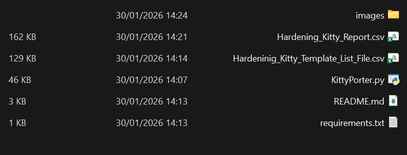
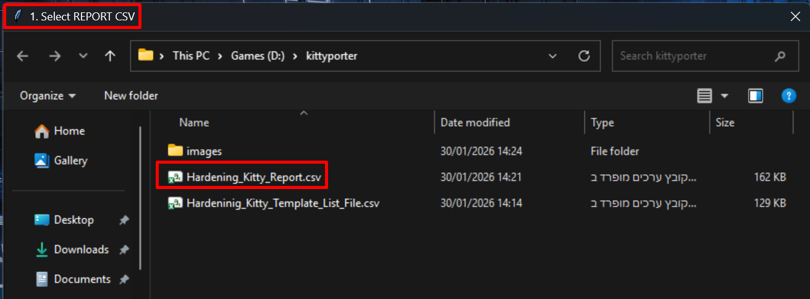
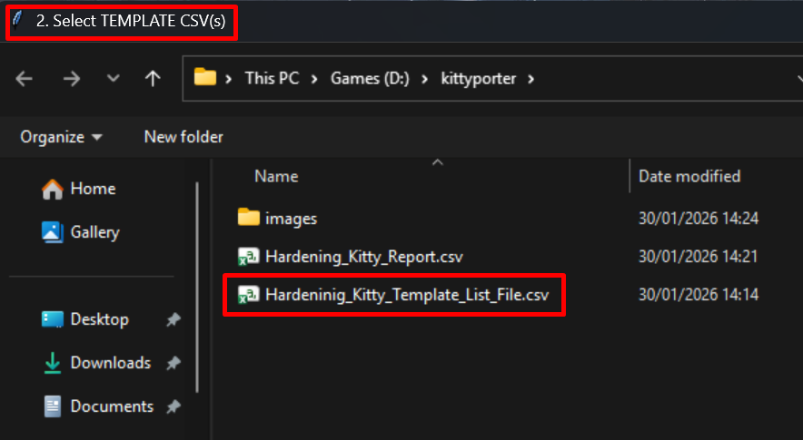
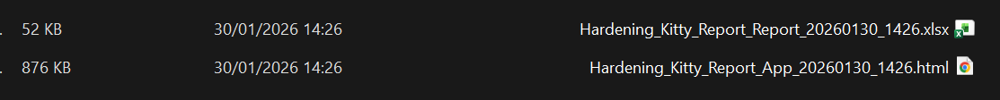
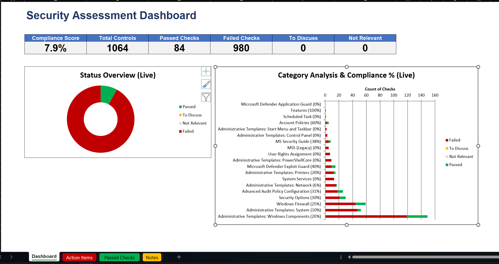
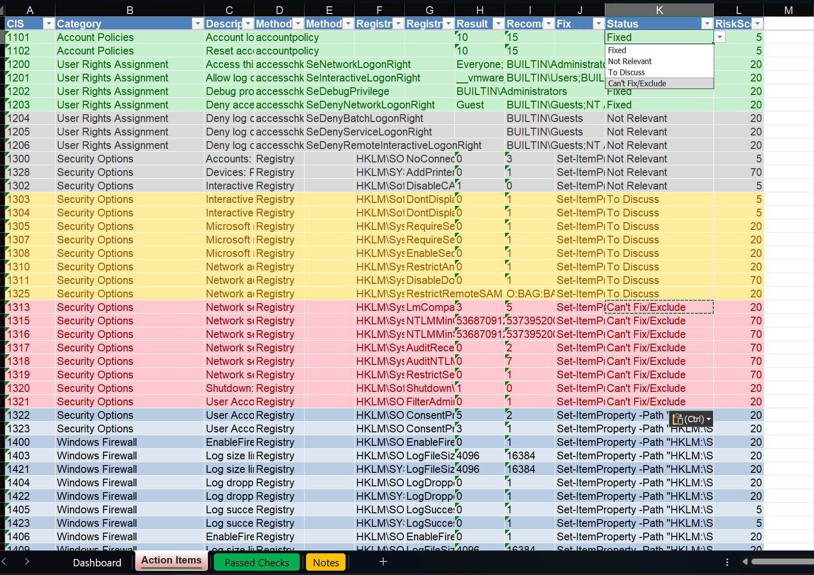
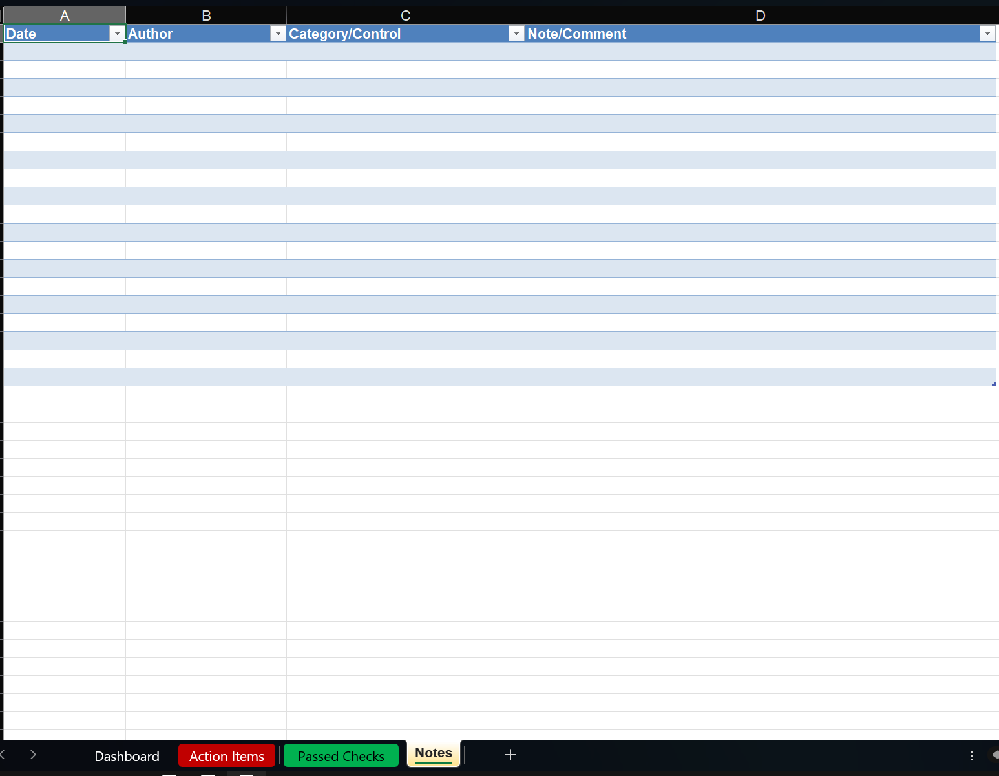
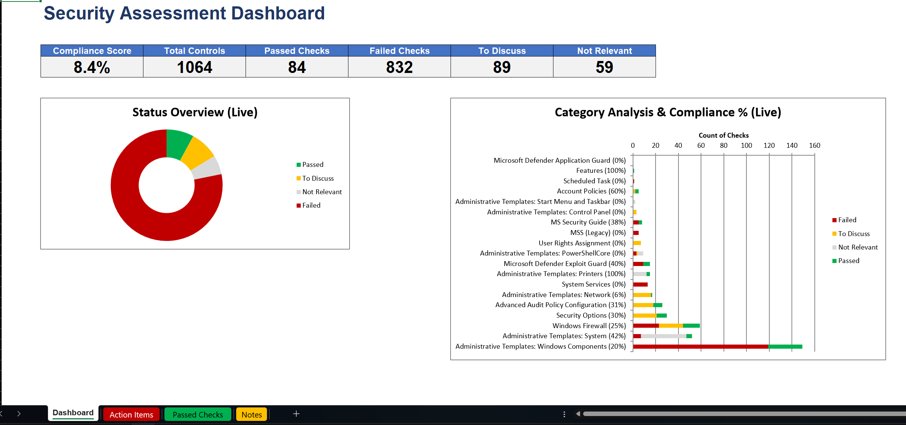
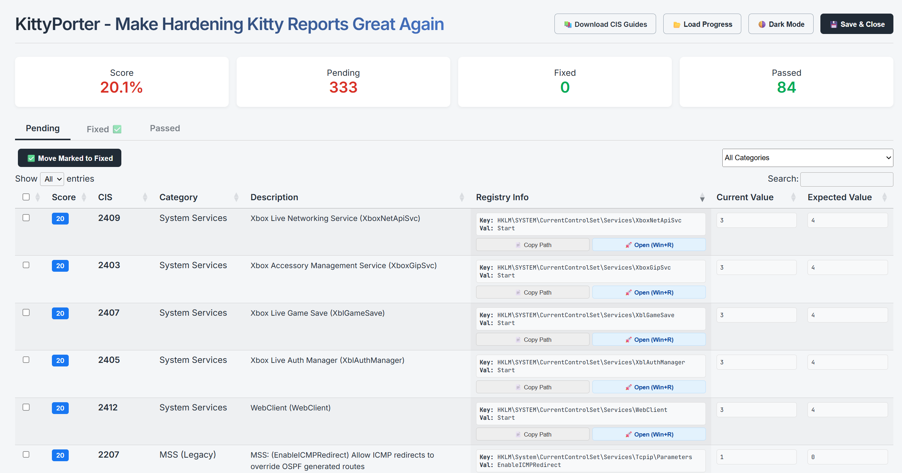

<div align="center">

# 🐈‍⬛ KittyPorter
### Make Hardening Kitty Reports Great Again


</div>

## Features

- **📊 Excel Dashboard**:
  - Auto-generated KPI cards (Compliance Score, Passed/Failed counts).
  - interactive charts showing compliance by category.
  - "Action Items" sheet for failed checks.
  - "Passed Checks" sheet for audit evidence.
  - **⚡ Dynamic Interaction**:
    - **Live Status Updates**: Change the status of any finding (e.g., to "Fixed", "To Discuss", "Not Relevant") directly in the Excel sheet.
    - **Color Coding**: The row color updates automatically based on your selection (Green for Fixed, Yellow for Discuss, etc.).
    - **Real-Time Dashboard**: The main Dashboard charts and scores update instantly as you modify statuses in the detail sheets.

- **🌐 HTML Actionable App**:
  - Modern, responsive UI with Dark Mode.
  - **One-Click Remediation**: Copy registry paths to view. verify and fix issues instantly.
  - **Interactive Filtering**: Filter by category or status (Pending, Fixed, Passed).
  - **Progress Tracking**: Save your progress to a JSON file and resume later.
  - **Offline Ready**: No external server required; everything runs locally.

## Installation

1. **Install Python**: Ensure Python 3.x is installed.
2. **Install Dependencies**:
    Run the following command to install required libraries:

    ```bash
    pip install -r requirements.txt
    ```

## Usage

1. **Prepare your Files**:
    - Have your Hardening Kitty CSV report ready (e.g., `machine_name_report.csv`).
    - (Optional) Have template CSV files if you want to enrich the data with descriptions.

2. **Run the Script**:

    ```bash
    python KittyPorter.py
    ```

3. **Follow the GUI Prompts**:
    - **Step 1**: Select your Hardening Kitty **REPORT CSV** file.
    - **Step 2**: Select one or more **TEMPLATE CSV** files (optional).

4. **View Results**:
    The script will generate two files in the same directory as your report:
    - `[Name]_Report_[Date].xlsx`: The Excel dashboard and audit log.
    - `[Name]_App_[Date].html`: The interactive HTML application.

## Report Structure

### Excel Report (`.xlsx`)

- **Dashboard**: High-level overview with charts and compliance scores.
- **Action Items**: A prioritized list of failed checks that need attention. Includes generated PowerShell fixes.
- **Passed Checks**: A list of checks that are compliant.
- **Stats**: Data source for the dashboard charts (hidden by default).

### HTML App (`.html`)

- **Pending**: Checks that failed and need fixing.
  - **Copy Path**: Copies the registry path to clipboard.
  - **Open (Win+R)**: Generates a command to open Regedit directly to the key.
- **Fixed**: Items you have marked as fixed during your session.
- **Passed**: Items that were already compliant.
- **Passed**: Items that were already compliant.

## Gallery - Workflow & Results

Below is a visual walkthrough of the tool's results and interface.

### 1. Folder Structure



### 2. Select CSV



### 3. Select List Template File



### 4. Generated Excel/HTML Files



### 5. Excel Dashboard



### 6. Excel Findings Example



### 7. Excel Notes Sheet If Needed



### 8. Excel Dashboard Dynmic Update By Changing Status of Findings



### 9. HTML Report Overview



# Legal Information

## ⚖️ License & Disclaimer

### Non-Commercial Use Only
This tool is provided for **educational, research, and internal security auditing purposes only**. Commercial use of this tool (e.g., as part of a paid consulting service or a commercial product) is strictly prohibited without prior authorization.

---

### CIS Benchmarks Copyright
The CIS Benchmarks are the property of the **Center for Internet Security (CIS)**. This tool facilitates access to official resources but does not host or redistribute copyrighted material. 

> [!IMPORTANT]
> Users are responsible for complying with the [CIS Non Membership & Licensing terms](https://www.cisecurity.org/terms-of-use-for-non-member-cis-products).

---

### Liability
This software is provided **"as is"**, without warranty of any kind. The author is not responsible for any damage, data loss, or system instability caused by the use of this tool. 

**Use it at your own risk.**


